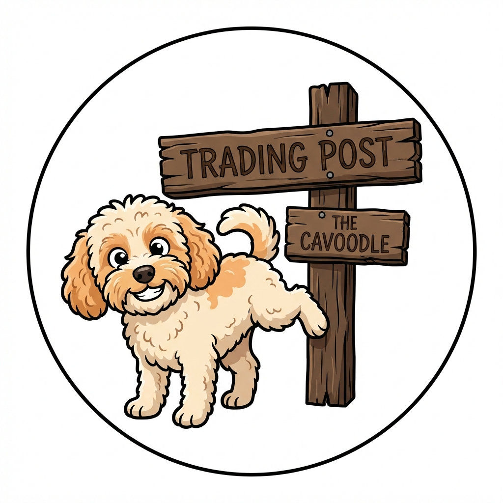

# The Cavoodle Trading Post 🐕

A quirky, engaging marketplace for buying and selling new and used cavoodles. Because every floofy friend deserves a loving home!



## Features

- 🐾 **Cavoodle Listings** - Browse, search, and filter by age, color, floof-level, and sass-rating
- 🎭 **Personality Quiz** - Each cavoodle gets a quirky personality profile (Professional Couch Thief, Olympic Zoomies Champion, etc.)
- ⭐ **Cavoodle Karma** - Seller/buyer reputation system
- 💬 **Real-time Messaging** - In-app chat between buyers and sellers
- 📱 **Cross-Platform** - Web, iOS, and Android from a single Flutter codebase

## Tech Stack

| Layer | Technology |
|-------|------------|
| **Frontend** | Flutter 3.x |
| **Backend** | .NET 9 (Minimal API) |
| **Database** | PostgreSQL 16 |
| **Cache** | Redis 7 |
| **Storage** | MinIO (S3-compatible) |
| **Hosting** | K3s on Raspberry Pi |
| **CDN** | Cloudflare |

## Quick Start

### Prerequisites

- .NET 9 SDK
- Flutter 3.x SDK
- Docker
- kubectl

### Backend Development

```bash
cd src/CavoodleTrading.Api

# Set development connection string
export ConnectionStrings__PostgreSQL="Host=localhost;Database=cavoodle_dev;Username=postgres;Password=postgres"

# Run
dotnet run

# Test
curl http://localhost:5000/health
```

### Frontend Development

```bash
cd frontend

# Get dependencies
flutter pub get

# Run on web
flutter run -d chrome

# Run with custom API
flutter run -d chrome --dart-define=API_URL=http://localhost:5000/api
```

### Docker Build

```bash
# Build API
docker build -t cavoodle-api .

# Build Frontend
docker build -t cavoodle-web frontend/
```

## API Endpoints

| Endpoint | Description |
|----------|-------------|
| `POST /api/auth/register` | Register new user |
| `POST /api/auth/login` | Login and get JWT |
| `GET /api/listings` | Browse listings (paginated, filterable) |
| `GET /api/listings/{id}` | Get listing details |
| `POST /api/listings` | Create listing (auth required) |
| `GET /api/quiz/questions` | Get personality quiz questions |
| `POST /api/quiz/calculate` | Calculate personality from answers |
| `GET /api/users/me` | Get current user profile |
| `GET /api/messages/conversations` | Get user's conversations |

## Personality Types

| Type | Display Name |
|------|-------------|
| `CouchThief` | Professional Couch Thief |
| `ZoomiesChampion` | Olympic Zoomies Champion |
| `TreatNegotiator` | Professional Treat Negotiator |
| `SockCollector` | Certified Sock Collector |
| `BarkingBarrister` | Barking Barrister |
| `VelcroVelvet` | Velcro Dog Extraordinaire |
| `GardenDestroyer` | Landscape Architect |
| `DramaQueen` | Dramatic Arts Major |

## Deployment

Deployments are automated via GitHub Actions on push to `main`.

### Manual Deployment

```bash
# Apply K8s manifests
kubectl apply -f .kube/deploy.yaml

# Check status
kubectl get pods -n cavoodle-trading
```

## Environment Variables

### API

| Variable | Description |
|----------|-------------|
| `ConnectionStrings__PostgreSQL` | PostgreSQL connection string |
| `ConnectionStrings__Redis` | Redis connection string |
| `Jwt__Secret` | JWT signing secret (64+ chars) |
| `Jwt__Issuer` | JWT issuer name |
| `Minio__Endpoint` | MinIO server endpoint |
| `Minio__AccessKey` | MinIO access key |
| `Minio__SecretKey` | MinIO secret key |

### Frontend

| Variable | Description |
|----------|-------------|
| `API_URL` | Backend API URL (mobile builds) |
| `WS_URL` | WebSocket URL for messaging |

## License

MIT

---

*"Where Every Pup Has a Story, and That Story Usually Involves Eating Something They Shouldn't"*
